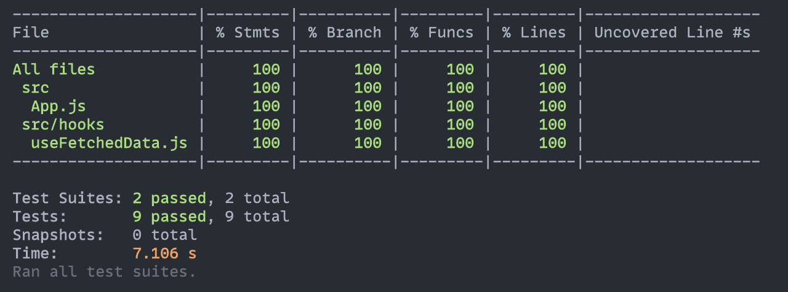

# How to test your custom hook with Jest and React Testing Library

It's been a while since I've written anything and today I thought it might be a good idea to write on how to test a custom React hook.

I created this [dedicated repo](https://github.com/asos-VasilisKortsimelidis/custom-hook-test) about it so you can just go now and play with the code or read the blog post first.

The App is straightforward, we make a request to an API and render the list of items that we get back. If the promise is pending we show the spinner, if there's an error we show the error.

```javascript
function App() {
  const { data, error, loading } = useFetchedData();

  return (
    <div className="App">
      {loading && <p>Loading...</p>}
      {error && <p>Error: {error.message}</p>}
      {data && (
        <ul>
          {data.map((post) => (
            <li key={post.id}>{post.title}</li>
          ))}
        </ul>
      )}
    </div>
  );
}
```

We grab all the values from the `useFetchedData` custom hook that we built. Let's see what this hook does and returns.

```javascript
const useFetchedData = () => {
  const [data, setData] = useState(null);
  const [error, setError] = useState(null);
  const [loading, setLoading] = useState(true);

  useEffect(() => {
    const abortController = new AbortController();

    const fetchData = async () => {
      try {
        const response = await fetch(API_URL, {
          signal: abortController.signal,
        });

        const json = await response.json();
        setData(json);
      } catch (error) {
        setError(error);
      } finally {
        setLoading(false);
      }
    };

    fetchData();

    return () => {
      abortController.abort();
    };
  }, []);

  return { data, error, loading };
};
```

## Quick explanation of the code

Initially we return an object with the initial values of the state variables.

We use useEffect to fire the request to the API, when we get the data back successfully we store the data to the `data` state variable and finally we update the `loading` variable. That would cause a re-render in our component and we will return the new object with the updated values.

Also if there's an error we store it in the `error` state variable and update the `loading` variable.

We also added a cleanup function to the useEffect hook to abort the request if the component unmounts.

## Test the `useFetchedData` hook

```javascript
import { renderHook } from "@testing-library/react";
import useFetchedData from "./useFetchedData";

global.fetch = jest.fn();

describe("useFetchedData", () => {
  it("should return the initial values for data, error and loading", async () => {
    const { result } = renderHook(() => useFetchedData());
    const { data, error, loading } = result.current;

    expect(data).toBe(null);
    expect(error).toBe(null);
    expect(loading).toBe(true);
  });
});
```

In this test we just want to test the initial values of our custom hook before the async request has been fulfilled. We use `renderHook` from `@testing-library/react` to render the hook and then we can access the values of the state variables. We then assert that the initial values are correct.

_Notice the mock on fetch. We don't need this mock for our first test but for the next one!_

## The request has been fulfilled successfully

```javascript
  describe("when data is fetched successfully", () => {
    let mockedData;

    beforeEach(() => {
      mockedData = [
        {
          body: "mocked body",
          id: 1,
          title: "mock title",
          userId: 1,
        },
      ];

      global.fetch.mockResolvedValue({
        json: jest.fn().mockResolvedValue(mockedData),
      });
    });

    it("should return data", async () => {
      const { result } = renderHook(() => useFetchedData());

      await waitFor(() =>
        expect(result.current).toEqual({
          data: mockedData,
          error: null,
          loading: false,
        })
      );
    });
  });
```

We add one more `describe` block to have our tests a bit more organised and we use `beforeEach` to mock the fetch function. We mock the fetch function to return a resolved promise with the mocked data. We then render the hook and we use [`waitFor`](https://testing-library.com/docs/dom-testing-library/api-async/#waitfor) from `@testing-library/react` to wait for the promise to be resolved. We then assert that the data is the one we expect.

Ok that was the happy path, let's now add the third test which is going to be our sad path. 😢 i.e when our API responds with an error.

## Testing the loading property

```javascript
  describe("the loading property", () => {
    it("should initially return true and then false", async () => {
      const { result } = renderHook(() => useFetchedData());
      const { loading } = result.current;

      expect(loading).toBe(true);

      await waitFor(() => {
        const { loading } = result.current;

        expect(loading).toBe(false);
      });
    });
  });
```

Again, we use `renderHook` to render the hook and we assert that the initial value of `loading` is true. Then we use [`waitFor`](https://testing-library.com/docs/dom-testing-library/api-async/#waitfor) to wait for the promise to be resolved and we assert that the value of `loading` is false.

## Testing the error scenario

```javascript
describe("when data is not fetched successfully", () => {
  const mockedError = new Error("mocked error");

  beforeEach(() => {
    fetch.mockRejectedValue(mockedError);
  });

  it("should return the Error", async () => {
    const { result } = renderHook(() => useFetchedData());

    await waitFor(() => {
      const { error } = result.current;
      expect(error).toBe(mockedError);
    });
  });
});
```

Similar to our happy path but different, we now use [`mockRejectedValue`](https://jestjs.io/docs/mock-function-api#mockfnmockrejectedvaluevalue) from Jest to mock the fetch function to return a rejected promise with the mocked error. We then render the hook and we use [`waitFor`](https://testing-library.com/docs/dom-testing-library/api-async/#waitfor) to wait for the promise to be rejected. We then assert that the error is the mocked we created.

## Quiz

At this point our test coverage tool reports that we have 100% coverage. Technically yes, that is because RTL by default runs a cleanup function after each test and this cleanup function aborts the fetch request. So our coverage thinks we covered everything but we don't have a test for that. So let's add one more final test.



No it's not so let's add one more test to cover the last thing we need to cover - the cleanup function.

## Fifth test - Testing the cleanup function

```javascript
describe("should abort the fetch request on unmount", () => {
  const mockedAbortController = {
    abort: jest.fn(),
  };

  beforeEach(() => {
    global.AbortController = jest.fn(() => mockedAbortController);
  });

  it("should abort the fetch request", async () => {
    const { unmount } = renderHook(() => useFetchedData());
    unmount();

    expect(mockedAbortController.abort).toHaveBeenCalled();
  });
});
```

I hope you are starting to see the pattern here. Mocking something in the beforeEach and then asserting that it has been called.

We use `beforeEach` to mock the `AbortController` function. We then render the hook and we call the [`unmount`](https://testing-library.com/docs/react-testing-library/api/#unmount) function from the result of the `renderHook` function. We then assert that the `abort` function has been called.